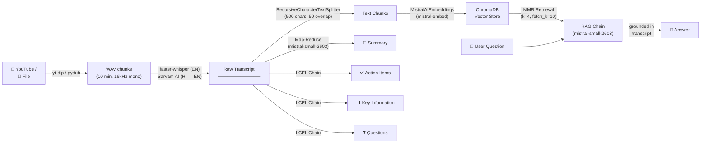

# VideoSense — AI Video Assistant

Drop a YouTube link or upload a video file. Get a transcript, summary, action items, key facts, and extracted questions — then **chat with the video** using RAG (Retrieval-Augmented Generation).

---

## Architecture



### Pipeline flow

1. **Acquire** — downloads YouTube audio via `yt-dlp`, or converts uploaded/local files to 16kHz mono WAV, splits into 10-minute chunks
2. **Transcribe** — English via **faster-whisper** (local, CUDA, batched inference), Hindi via **Sarvam AI** (cloud, with translation)
3. **Analyze** — LLM passes (Mistral) extract the title, summary (map-reduce), action items, key information, and questions
4. **Index** — chunks the transcript, embeds with Mistral, stores in ChromaDB with MMR retrieval. The RAG chain answers questions grounded in the video

---

## Setup

### Prerequisites

- **Python 3.13+**
- **Node.js 18+** (for the frontend)
- **ffmpeg** (for audio processing — `brew install ffmpeg` / `apt install ffmpeg`)
- **CUDA-capable GPU** (optional — faster-whisper falls back to CPU)

### 1. Clone & install backend

```bash
git clone <repo-url>
cd "AI video assistant"

# Create virtual environment
python -m venv .venv
source .venv/bin/activate  # Windows: .venv\Scripts\activate

# Install dependencies
pip install -r requirements.txt
```

### 2. Configure environment

Create a `.env` file in the project root:

```env
MISTRAL_API_KEY=your-mistral-api-key
WHISPER_MODEL=turbo
SARVAM_API_KEY=your-sarvam-api-key      # only needed for Hindi
SARVAM_STT_MODEL=saaras:v3
```

> Get a Mistral API key from [console.mistral.ai](https://console.mistral.ai). Sarvam is only required if you plan to transcribe Hindi audio.

### 3. Install frontend

```bash
cd UI
npm install
```

---

## Running

### Start the backend

```bash
uvicorn server:app --reload
```

Runs on `http://localhost:8000`. Swagger docs at `http://localhost:8000/docs`.

### Start the frontend

```bash
cd UI
npm run dev
```

Runs on `http://localhost:5173`. Calls the backend at `http://localhost:8000`.

> **CORS tip:** Add a Vite proxy to sidestep CORS during development:
> ```ts
> // UI/vite.config.ts
> export default defineConfig({
>   server: { proxy: { "/api": "http://localhost:8000" } },
>   // ...
> });
> ```
> Then set `VITE_API_URL=""` in your environment or `.env` file.

---

## API Reference

| Method | Endpoint | Description |
|--------|----------|-------------|
| `POST` | `/api/upload` | Upload a video/audio file (multipart). Returns `{ file_id }`. |
| `POST` | `/api/process` | Start pipeline. Body: `{ source, language }`. Returns `{ job_id, status }`. |
| `GET` | `/api/process/{id}/status` | Poll progress. Returns `{ job_id, status, progress? }`. |
| `GET` | `/api/process/{id}/results` | Get results. Returns `{ title, summary, actionables, questions, information }`. |
| `POST` | `/api/process/{id}/ask` | Chat with the video. Body: `{ question }`. Returns `{ answer }`. |
| `GET` | `/api/jobs` | List all jobs (history). Returns `{ jobs: [...] }`. |
| `DELETE` | `/api/jobs/{id}` | Delete a job and its data. |

### Status values

- `processing` — pipeline is running, poll every 3s
- `done` — results ready, RAG chain active
- `error` — something failed, check the `error` field

---

## CLI Usage

The original CLI entry point still works:

```bash
python main.py
```

Prompts for a YouTube URL or local file path, runs the full pipeline, and starts an interactive chat session in the terminal.

---

## Testing

```bash
python test.py
```

Runs the pipeline against a hardcoded YouTube video and prints the results.

---

## Tech Stack

| Layer | Technology |
|-------|-----------|
| **Backend framework** | FastAPI |
| **Job store** | SQLite |
| **Speech-to-text** | faster-whisper (English), Sarvam AI (Hindi) |
| **LLM** | Mistral (`mistral-small-2603`) via LangChain |
| **Embeddings** | Mistral (`mistral-embed`) |
| **Vector DB** | ChromaDB |
| **Audio** | yt-dlp, pydub, ffmpeg |
| **Frontend** | React 18, TypeScript, Vite, Tailwind CSS 4, shadcn/ui, motion |
| **RAG framework** | LangChain (LCEL chains) |

---

## Project Structure

```
.
├── server.py              # FastAPI app + all endpoints
├── db.py                  # SQLite job store
├── main.py                # CLI entry point
├── test.py                # Hardcoded integration test
├── requirements.txt
├── .env                   # API keys (gitignored)
│
├── core/                  # Pipeline modules (unchanged)
│   ├── transcriber.py     # Whisper + Sarvam STT
│   ├── summarize.py       # Map-reduce summary + title
│   ├── extractor.py       # Action items, key info, questions
│   ├── rag_engine.py      # ChromaDB + RAG chain
│   └── vector_store.py    # Embeddings + retrieval
│
├── utils/
│   └── audio_processor.py # YouTube download, WAV conversion, chunking
│
├── UI/                    # React frontend
│   ├── src/app/
│   │   ├── App.tsx
│   │   ├── lib/videoApi.ts
│   │   └── components/
│   │       ├── input-section.tsx
│   │       ├── processing-state.tsx
│   │       ├── results-section.tsx
│   │       ├── chat-panel.tsx
│   │       └── history-sidebar.tsx
│   └── package.json
│
└── vector_db/             # ChromaDB persistence (gitignored)
```
