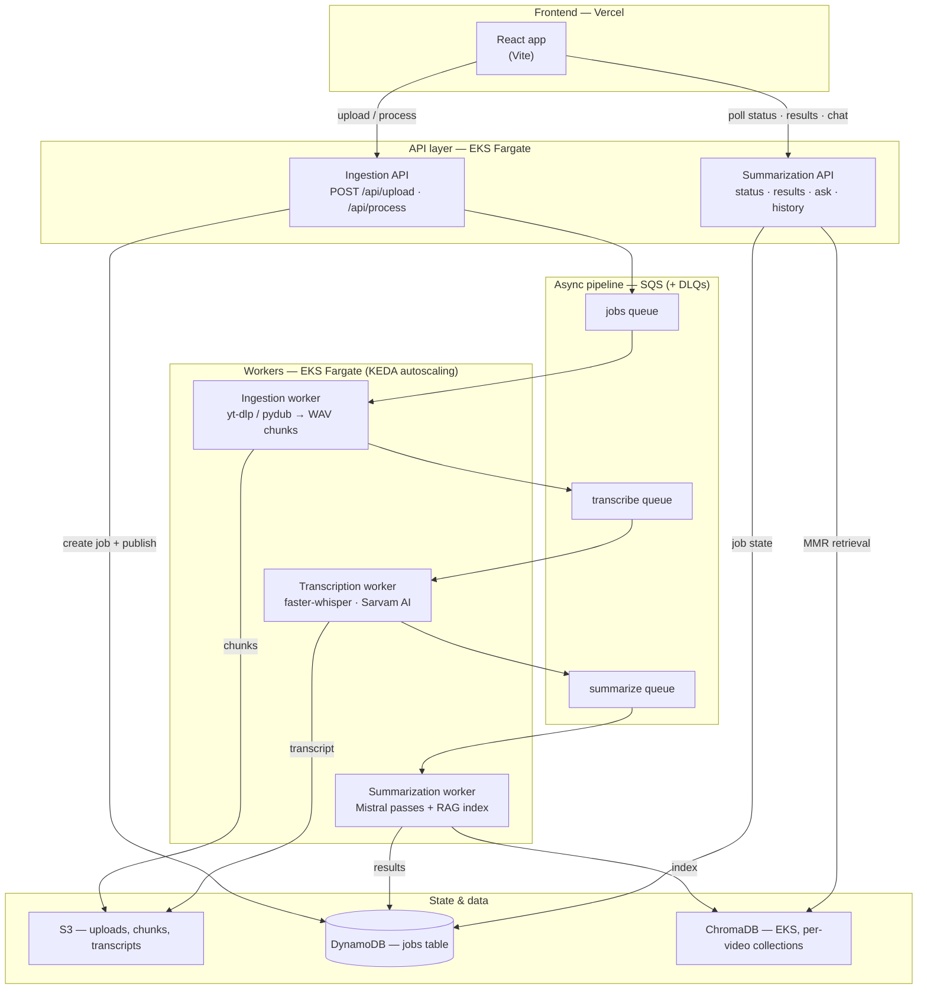
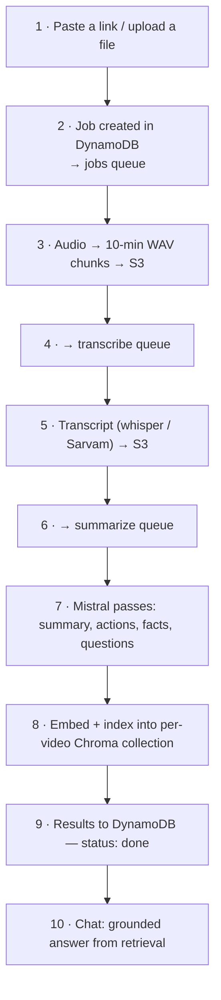
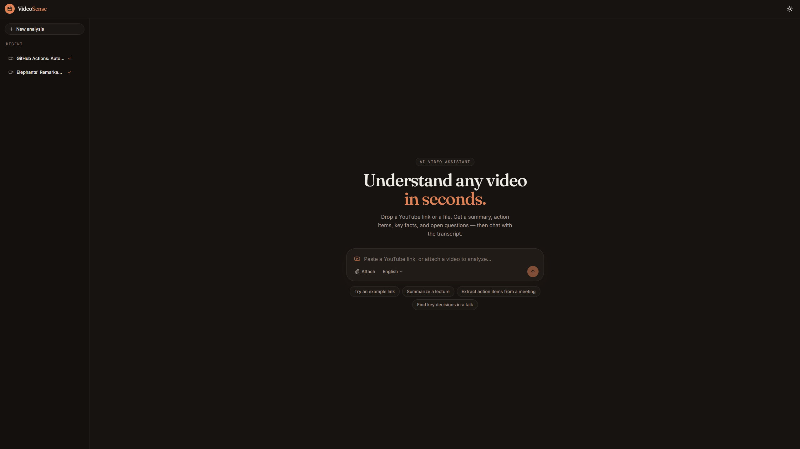
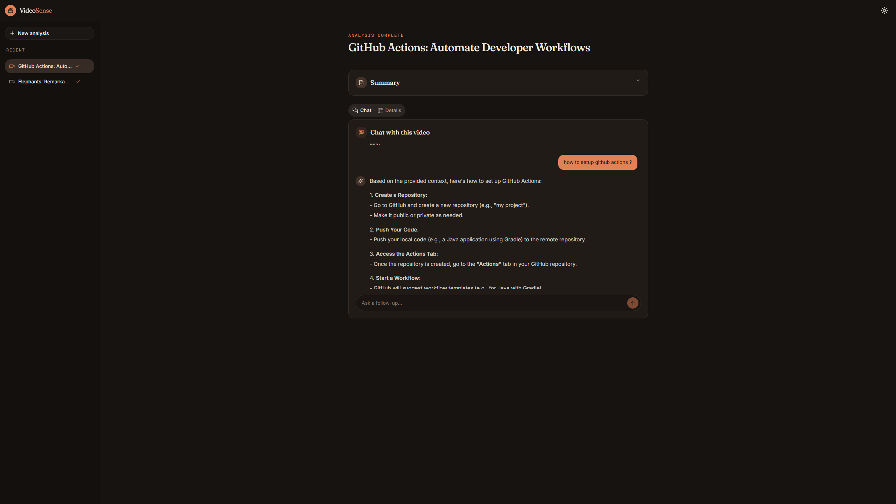
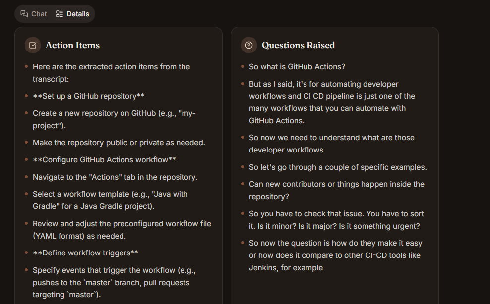

# VideoSense — AI Video Assistant

Paste a YouTube link or upload a video. Get a transcript, summary, action items, key facts, and extracted questions — then **chat with the video** using RAG (Retrieval-Augmented Generation).

**Live demo:** [ai-video-assistant on Vercel](https://ai-video-assistant-c62wn7x4l-texz-genzs-projects.vercel.app/)

---

## Architecture

VideoSense is built as **three FastAPI microservices** running on **Amazon EKS (Fargate)**, decoupled by an **SQS pipeline** so each stage scales independently. All state lives in AWS managed services; the only stateful self-hosted component is ChromaDB.


```mermaid
flowchart TB
    subgraph UI["Frontend — Vercel"]
        React["React app<br/>(Vite)"]
    end

    subgraph API["API layer — EKS Fargate"]
        IngAPI["Ingestion API<br/>POST /api/upload · /api/process"]
        SumAPI["Summarization API<br/>status · results · ask · history"]
    end

    subgraph Queues["Async pipeline — SQS (+ DLQs)"]
        Q1["jobs queue"]
        Q2["transcribe queue"]
        Q3["summarize queue"]
    end

    subgraph Workers["Workers — EKS Fargate (KEDA autoscaling)"]
        IngW["Ingestion worker<br/>yt-dlp / pydub → WAV chunks"]
        TrW["Transcription worker<br/>faster-whisper · Sarvam AI"]
        SuW["Summarization worker<br/>Mistral passes + RAG index"]
    end

    subgraph Storage["State & data"]
        S3["S3 — uploads, chunks, transcripts"]
        DDB[("DynamoDB — jobs table")]
        CHROMA["ChromaDB — EKS, per-video collections"]
    end

    React -->|"upload / process"| IngAPI
    React -->|"poll status · results · chat"| SumAPI

    IngAPI -->|"create job + publish"| DDB
    IngAPI --> Q1
    Q1 --> IngW
    IngW -->|"chunks"| S3
    IngW --> Q2

    Q2 --> TrW
    TrW -->|"transcript"| S3
    TrW --> Q3

    Q3 --> SuW
    SuW -->|"results"| DDB
    SuW -->|"index"| CHROMA

    SumAPI -->|"job state"| DDB
    SumAPI -->|"MMR retrieval"| CHROMA
```

### The job lifecycle


```mermaid
flowchart TB
    A["1 · Paste a link / upload a file"] --> B["2 · Job created in DynamoDB<br/>→ jobs queue"]
    B --> C["3 · Audio → 10-min WAV chunks → S3"]
    C --> D["4 · → transcribe queue"]
    D --> E["5 · Transcript (whisper / Sarvam) → S3"]
    E --> F["6 · → summarize queue"]
    F --> G["7 · Mistral passes: summary, actions, facts, questions"]
    G --> H["8 · Embed + index into per-video Chroma collection"]
    H --> I["9 · Results to DynamoDB — status: done"]
    I --> J["10 · Chat: grounded answer from retrieval"]
```

Step by step:

1. **Paste a YouTube URL or upload a file.** The ingestion API streams uploads to S3 (`uploads/{file_id}`).
2. **The job is created in DynamoDB** (`status: processing`) and a message is published to the **jobs queue**.
3. **The ingestion worker** downloads the video (yt-dlp) or fetches the staged upload, converts it to 16 kHz mono WAV, and splits it into 10-minute chunks → `jobs/{job_id}/chunks/` in S3.
4. It publishes to the **transcribe queue** and the job progress updates to *"Queued for transcription"*.
5. **The transcription worker** downloads the chunks in order and transcribes them — faster-whisper for English, Sarvam AI (translated to English) for Hindi. The joined transcript is stored at `jobs/{job_id}/transcript.txt`.
6. It publishes to the **summarize queue**.
7. **The summarization worker** runs the LangChain LLM passes: title, map-reduce summary, action items, key information, and questions raised.
8. The transcript is chunked, embedded with **Mistral**, and indexed into a **per-video ChromaDB collection** (MMR retrieval, k=4). Re-indexing never duplicates chunks — the collection is reset first.
9. Results are written to DynamoDB and the job flips to `done`.
10. **Chat.** `POST /api/process/{id}/ask` retrieves the most relevant chunks and the LLM answers **grounded in the video only** — if the answer isn't in the context, it says so.

Each queue has a **DLQ** (`maxReceiveCount=3`): crashed workers redrive; business failures are recorded on the job instead.

## Why this design

- **Three services, one concern each.** Ingestion only acquires and stages audio; transcription only turns audio into text; summarization only analyzes text and serves chat. Each can be developed, scaled, and failed independently.
- **SQS decouples everything.** A worker that dies mid-job doesn't block the system: the message isn't acknowledged, becomes visible again after the visibility timeout, and lands in a **DLQ** after 3 failed attempts. No data is lost.
- **KEDA autoscaling.** Each worker scales on its queue depth (0 → 4 replicas). Idle workers cost nothing; a burst of videos spins up workers automatically. The scaling was verified live during the EKS deployment.
- **ChromaDB per-video collections.** Retrieval for one video can never bleed into another — the old shared-collection approach caused cross-contamination; collections are now isolated and deleted with the job.
- **Grounded answers.** The RAG prompt constrains the model to answer only from retrieved context and to say when the information isn't in the video — no hallucinated answers about content that wasn't there.
- **Stateless containers, stateful AWS.** Pods are disposable: any worker can be killed and replaced without losing work, because everything durable lives in S3, DynamoDB, and ChromaDB (with the whisper model cache on EFS so new pods don't re-download weights).

---

## Setup (local development)

### Prerequisites

- **Python 3.13+**, **Node.js 18+**, **ffmpeg**
- AWS access for the state layer: real AWS credentials (`aws configure`), or the localstack compose stack

### 1. Install backend

```bash
python -m venv .venv
.venv\Scripts\activate          # Windows (or source .venv/bin/activate)
uv pip install --python .venv/Scripts/python.exe -r requirements.txt
```

### 2. Configure environment (`.env`)

```env
MISTRAL_API_KEY=your-mistral-api-key
WHISPER_MODEL=small             # "small" for CPU, "turbo" for GPU
WHISPER_DEVICE=cpu              # "cpu" (cloud) | "cuda" (local GPU)
SARVAM_API_KEY=your-sarvam-api-key   # only needed for Hindi
SARVAM_STT_MODEL=saaras:v3
```

AWS wiring (defaults shown; the compose stack sets `AWS_ENDPOINT_URL` automatically):

```env
JOBS_TABLE=videosense-jobs
JOBS_BUCKET=videosense-jobs
JOBS_QUEUE=videosense-jobs
TRANSCRIBE_QUEUE=videosense-transcribe
SUMMARIZE_QUEUE=videosense-summarize
CORS_ORIGINS=*                  # comma-separated; set to your frontend origin in prod
```

### 3. Run

Each service has an API and/or a worker process:

```bash
uvicorn services.ingestion.app:app --reload          --port 8001   # API
python -m services.ingestion.worker                               # worker
python -m services.transcription.worker                           # worker
uvicorn services.summarization.app:app --reload      --port 8002   # API
python -m services.summarization.worker                           # worker
```

> The services are AWS-native: without credentials or localstack the ingestion
> API fails fast at startup (by design). The recommended local setup is the
> docker-compose stack, which runs all services + workers + ChromaDB +
> localstack with one command.

### 4. Frontend

```bash
cd UI
npm install
npm run dev        # http://localhost:5173, calls VITE_API_URL (default localhost:8000)
```

---

## API Reference

| Method | Endpoint | Service | Description |
|--------|----------|---------|-------------|
| `POST` | `/api/upload` | ingestion | Upload a video/audio file (multipart, max 500 MB). Returns `{ file_id }`. |
| `POST` | `/api/process` | ingestion | Start pipeline. Body: `{ source, language }`. Returns `{ job_id, status }`. |
| `GET` | `/api/process/{id}/status` | summarization | Poll progress. |
| `GET` | `/api/process/{id}/results` | summarization | Get results. |
| `POST` | `/api/process/{id}/ask` | summarization | Chat with the video. Body: `{ question }`. |
| `GET` | `/api/jobs` | summarization | List all jobs (history). |
| `DELETE` | `/api/jobs/{id}` | summarization | Delete a job and all its data (S3 + Chroma + DynamoDB). |
| `GET` | `/health` | both | Liveness. |

Status values: `processing` → `done` | `error`.

In production both APIs sit behind one load balancer with path-based routing (`/api/upload`, `/api/process` → ingestion; everything else → summarization), so the frontend keeps a single base URL.

---

## Deployment (Amazon EKS)

Everything is scripted — no Terraform, no Helm, just eksctl + AWS CLI + plain manifests:

```bash
./infra/aws-provision.sh     # cluster, ECR, S3, DynamoDB, SQS+DLQs, EFS,
                             # ALB controller, cert-manager, EFS CSI, KEDA (~20 min)
./k8s/apply.sh               # secrets, manifests, ingress; waits for the ALB
./infra/aws-teardown.sh      # destroy everything — back to $0/mo (~15 min)
```

The frontend deploys to **Vercel** (root dir `UI`, build `npm run build`, output `dist`).
`UI/vercel.json` proxies `/api/*` to the ALB, so the browser never hits mixed-content or CORS issues.

See `infra/README.md` and `k8s/README.md` for the full details.

---

## Screenshots

| | |
| --- | --- |
| **Home — paste a link or upload a file** | **Results + chat** |
|  |  |
| **Action Items + summary** | |
|  | |

---

## Testing

```bash
.venv\Scripts\python -m pytest          # unit + integration tests (moto-emulated AWS)
```

Coverage: job store CRUD, S3 layout/cleanup, SQS pipeline semantics (DLQ/ack), ingestion worker (real audio through ffmpeg), transcription worker (chunk ordering, backend routing, error paths), summarization worker + API (cold-pod rebuild, delete cleanup).

---

## Project Structure

```
.
├── services/
│   ├── ingestion/        # upload + process API, SQS worker (audio acquisition)
│   ├── transcription/    # SQS worker (whisper / Sarvam STT)
│   └── summarization/    # status/results/ask/jobs API, SQS worker (LLM + RAG)
├── shared/
│   ├── dynamo.py         # job store (DynamoDB)
│   ├── s3.py             # per-job object layout + transfer helpers
│   ├── queue.py          # SQS pipeline (3 queues + DLQs)
│   ├── models.py         # pydantic API models
│   └── config.py         # env-driven config (CORS)
├── tests/                # pytest + moto suite
├── infra/                # aws-provision.sh / aws-teardown.sh / README
├── k8s/                  # manifests + apply.sh / README
├── UI/                   # React frontend (Vite) + screenshots
├── Dockerfile.*          # per-service images
├── docker-compose.yml    # local full stack (services + Chroma + localstack)
└── requirements.txt
```

---

## Tech Stack

| Layer | Technology |
|-------|-----------|
| **Services** | FastAPI microservices (ingestion / transcription / summarization) |
| **Async jobs** | Amazon SQS (3 queues + DLQs), KEDA autoscaling (0→4 on queue depth) |
| **Job state** | Amazon DynamoDB |
| **Storage** | Amazon S3 (uploads, chunks, transcripts) |
| **Speech-to-text** | faster-whisper (English), Sarvam AI (Hindi → English) |
| **LLM** | Mistral (`mistral-small-2603`) via LangChain |
| **Embeddings** | Mistral (`mistral-embed`) |
| **Vector DB** | self-hosted ChromaDB (per-job collections, MMR k=4) |
| **Frontend** | React 18, TypeScript, Vite, Tailwind CSS 4, shadcn/ui |
| **RAG framework** | LangChain (LCEL chains) |
