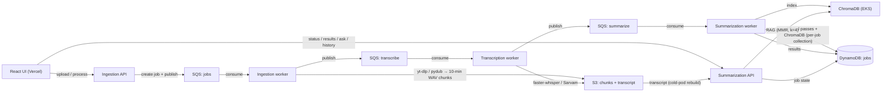

# VideoSense — AI Video Assistant

Drop a YouTube link or upload a video file. Get a transcript, summary, action items, key facts, and extracted questions — then **chat with the video** using RAG (Retrieval-Augmented Generation).

---

## Architecture

Three FastAPI microservices orchestrated by an SQS pipeline, with all state in AWS:


```mermaid
flowchart LR
    Browser["React UI (Vercel)"] -->|"upload / process"| IngAPI["Ingestion API"]
    Browser -->|"status / results / ask / history"| SumAPI["Summarization API"]

    IngAPI -->|"create job + publish"| Q1["SQS: jobs"]
    Q1 -->|"consume"| IngWorker["Ingestion worker"]
    IngWorker -->|"yt-dlp / pydub → 10-min WAV chunks"| S3
    IngWorker -->|"publish"| Q2["SQS: transcribe"]

    Q2 -->|"consume"| TWorker["Transcription worker"]
    TWorker -->|"faster-whisper / Sarvam"| S3["S3: chunks + transcript"]
    TWorker -->|"publish"| Q3["SQS: summarize"]

    Q3 -->|"consume"| SWorker["Summarization worker"]
    SWorker -->|"Mistral passes + ChromaDB (per-job collection)"| DDB[("DynamoDB: jobs")]
    SWorker -->|"results"| DDB
    SWorker -->|"index"| Chroma["ChromaDB (EKS)"]

    SumAPI -->|"RAG (MMR, k=4)"| Chroma
    SumAPI -->|"job state"| DDB
    S3 -->|"transcript (cold-pod rebuild)"| SumAPI
```

### The job lifecycle

1. **Ingestion** — `POST /api/upload` streams the file to S3 (`uploads/{file_id}`); `POST /api/process` creates the job in DynamoDB and publishes to the **jobs** queue. The ingestion worker downloads (YouTube) or fetches (staged upload), converts to 16 kHz mono WAV, splits into 10-minute chunks, uploads them to `jobs/{job_id}/chunks/`, and publishes to the **transcribe** queue.
2. **Transcription** — the worker downloads the chunks (in order!), transcribes English with **faster-whisper** (CPU/GPU configurable) or Hindi with **Sarvam AI** (translated to English), stores the transcript at `jobs/{job_id}/transcript.txt`, and publishes to the **summarize** queue.
3. **Summarization** — the worker runs the LLM passes (title, map-reduce summary, action items, key information, questions), indexes the transcript into a **per-job ChromaDB collection** (MMR retrieval, k=4), and writes results to DynamoDB.
4. **Chat** — `POST /api/process/{id}/ask` answers questions grounded in the video. Chains live in pod memory; a cold pod rebuilds from the stored transcript.

Every queue has a **DLQ** (`maxReceiveCount=3`): crashed workers redrive; business failures are recorded on the job instead.

---

## Setup (local development)

### Prerequisites

- **Python 3.13+**, **Node.js 18+**, **ffmpeg**
- AWS access for the state layer: real AWS credentials (`aws configure`), or the localstack compose stack (see `docker-compose.yml`)

### 1. Install backend

```bash
python -m venv .venv
.venv\Scripts\activate          # Windows (or source .venv/bin/activate)
uv pip install --python .venv/Scripts/python.exe -r requirements.txt
```

### 2. Configure environment (`.env`)

```env
MISTRAL_API_KEY=your-mistral-api-key
WHISPER_MODEL=small             # "small" for CPU, "turbo" for GPU
WHISPER_DEVICE=cpu              # "cpu" (cloud) | "cuda" (local GPU)
SARVAM_API_KEY=your-sarvam-api-key   # only needed for Hindi
SARVAM_STT_MODEL=saaras:v3
```

AWS wiring (defaults shown; the compose stack sets `AWS_ENDPOINT_URL` automatically):

```env
JOBS_TABLE=videosense-jobs
JOBS_BUCKET=videosense-jobs
JOBS_QUEUE=videosense-jobs
TRANSCRIBE_QUEUE=videosense-transcribe
SUMMARIZE_QUEUE=videosense-summarize
CORS_ORIGINS=*                  # comma-separated; set to your frontend origin in prod
```

### 3. Run

Each service has an API and/or a worker process:

```bash
uvicorn services.ingestion.app:app --reload          --port 8001   # API
python -m services.ingestion.worker                               # worker
python -m services.transcription.worker                           # worker
uvicorn services.summarization.app:app --reload      --port 8002   # API
python -m services.summarization.worker                           # worker
```

> The services are AWS-native: without credentials or localstack the ingestion
> API fails fast at startup (by design). The recommended local setup is the
> docker-compose stack, which runs all services + workers + ChromaDB +
> localstack with one command.

### 4. Frontend

```bash
cd UI
npm install
npm run dev        # http://localhost:5173, calls VITE_API_URL (default localhost:8000)
```

---

## API Reference

| Method | Endpoint | Service | Description |
|--------|----------|---------|-------------|
| `POST` | `/api/upload` | ingestion | Upload a video/audio file (multipart, max 500 MB). Returns `{ file_id }`. |
| `POST` | `/api/process` | ingestion | Start pipeline. Body: `{ source, language }`. Returns `{ job_id, status }`. |
| `GET` | `/api/process/{id}/status` | summarization | Poll progress. |
| `GET` | `/api/process/{id}/results` | summarization | Get results. |
| `POST` | `/api/process/{id}/ask` | summarization | Chat with the video. Body: `{ question }`. |
| `GET` | `/api/jobs` | summarization | List all jobs (history). |
| `DELETE` | `/api/jobs/{id}` | summarization | Delete a job and all its data (S3 + Chroma + DynamoDB). |
| `GET` | `/health` | both | Liveness. |

Status values: `processing` → `done` | `error`.

In production both APIs sit behind one load balancer with path-based routing (`/api/upload`, `/api/process` → ingestion; everything else → summarization), so the frontend keeps a single `VITE_API_URL`.

---

## Testing

```bash
.venv\Scripts\python -m pytest          # unit + integration tests (moto-emulated AWS)
```

Coverage: job store CRUD, S3 layout/cleanup, SQS pipeline semantics (DLQ/ack), ingestion worker (real audio through ffmpeg), transcription worker (chunk ordering, backend routing, error paths), summarization worker + API (cold-pod rebuild, delete cleanup).

---

## Project Structure

```
.
├── services/
│   ├── ingestion/        # upload + process API, SQS worker (audio acquisition)
│   ├── transcription/    # SQS worker (whisper / Sarvam STT)
│   └── summarization/    # status/results/ask/jobs API, SQS worker (LLM + RAG)
├── shared/
│   ├── dynamo.py         # job store (DynamoDB)
│   ├── s3.py             # per-job object layout + transfer helpers
│   ├── queue.py          # SQS pipeline (3 queues + DLQs)
│   ├── models.py         # pydantic API models
│   └── config.py         # env-driven config (CORS)
├── tests/                # pytest + moto suite
├── UI/                   # React frontend (Vite)
├── Dockerfile.*          # per-service images
├── docker-compose.yml    # local full stack (services + Chroma + localstack)
└── requirements.txt
```

---

## Tech Stack

| Layer | Technology |
|-------|-----------|
| **Services** | FastAPI microservices (ingestion / transcription / summarization) |
| **Async jobs** | Amazon SQS (3 queues + DLQs) |
| **Job state** | Amazon DynamoDB |
| **Storage** | Amazon S3 (uploads, chunks, transcripts) |
| **Speech-to-text** | faster-whisper (English), Sarvam AI (Hindi → English) |
| **LLM** | Mistral (`mistral-small-2603`) via LangChain |
| **Embeddings** | Mistral (`mistral-embed`) |
| **Vector DB** | self-hosted ChromaDB (per-job collections, MMR k=4) |
| **Frontend** | React 18, TypeScript, Vite, Tailwind CSS 4, shadcn/ui |
| **RAG framework** | LangChain (LCEL chains) |
